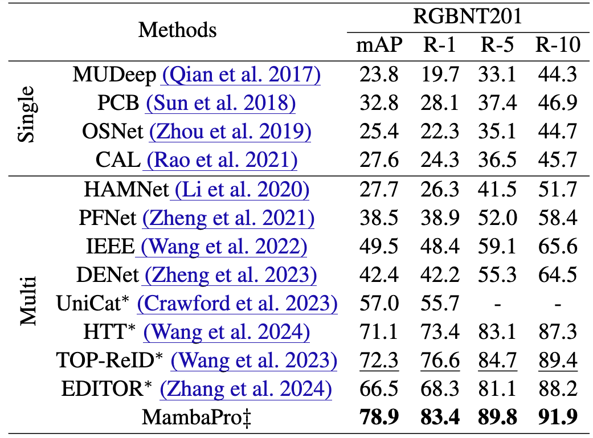
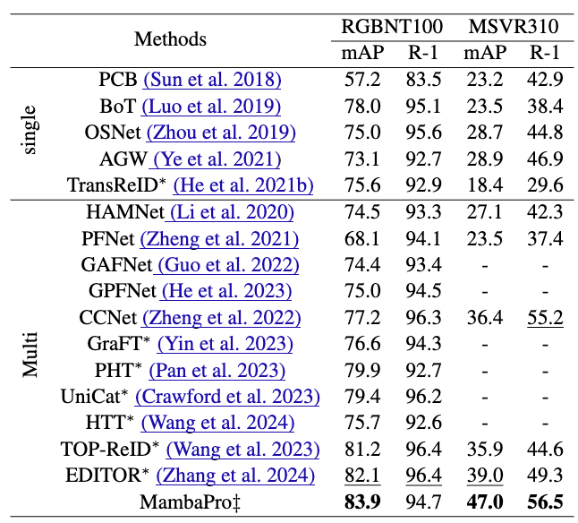
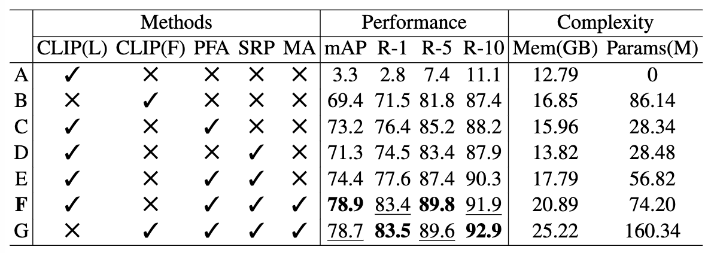
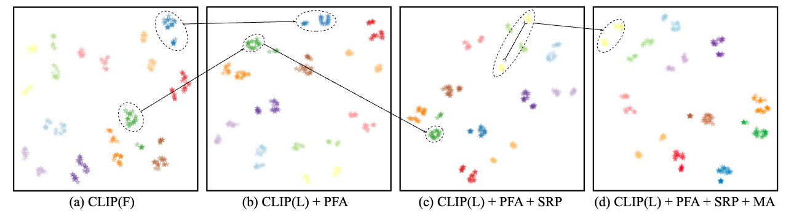
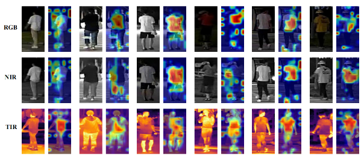
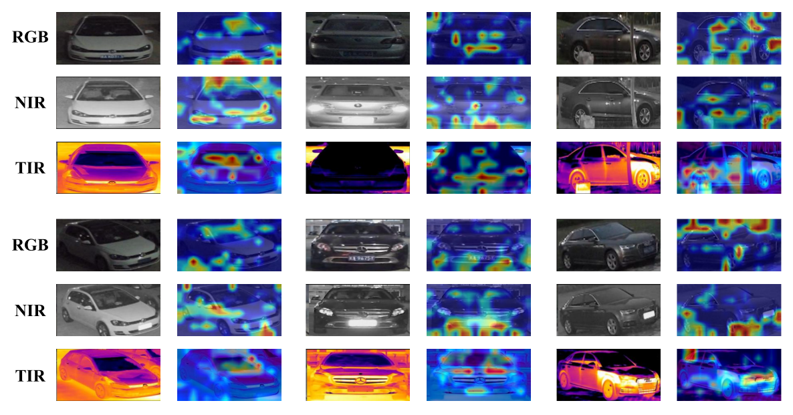

<p align="center">
  <h1 align="center">MambaPro: Multi-Modal Object Re-Identification with Mamba Aggregation and Synergistic Prompt</h1>
</p>
  <p align="center">
    
  <p align="center">
<p align="center">
    <a href="https://scholar.google.com/citations?user=WZvjVLkAAAAJ&hl=zh-CN" rel="external nofollow noopener" target="_blank"><strong>Yuhao Wang</strong></a>
    ·
    <a href="https://scholar.google.com/citations?user=6R4C_6wAAAAJ&hl=zh-CN&oi=ao" rel="external nofollow noopener" target="_blank"><strong>Xuehu Liu</strong></a>
    ·
    <a href="https://openreview.net/profile?id=~Tianyu_Yan2" rel="external nofollow noopener" target="_blank"><strong>Tianyu Yan</strong></a>
    ·
    <a href="https://dblp.org/pid/51/3710-66.html" rel="external nofollow noopener" target="_blank"><strong>Yang Liu</strong></a>
    ·
    <a href="https://ai.ahu.edu.cn/2022/0407/c19212a283203/page.htm" rel="external nofollow noopener" target="_blank"><strong>Aihua Zheng</strong></a>
    ·
    <a href="https://scholar.google.com/citations?user=MfbIbuEAAAAJ&hl=zh-CN" rel="external nofollow noopener" target="_blank"><strong>Pingping Zhang*</strong></a>
    ·
    <a href="#" rel="external nofollow noopener" target="_blank"><strong>Huchuan Lu</strong></a>
</p>

<p align="center">
    <a href="https://arxiv.org/abs/2312.09612" rel="external nofollow noopener" target="_blank">AAAI 2025 Paper</a>
</p>

<p align="center">
    
</p>

**MambaPro** is a novel multi-modal object ReID framework that integrates CLIP's pre-trained capabilities with state-of-the-art multi-modal aggregation techniques. Using **Parallel Feed-Forward Adapters (PFA)**, **Synergistic Residual Prompts (SRP)**, and the innovative **Mamba Aggregation (MA)** mechanism, it achieves robust performance with reduced computational complexity. MambaPro sets new standards in handling long sequences and missing modalities.

---

## News
Great news! Our paper has been accepted to **AAAI 2025**! 🎉 [Paper](https://arxiv.org/abs/2312.09612)

---

## Table of Contents
- [Introduction](#introduction)
- [Contributions](#contributions)
- [Results](#results)
- [Visualizations](#visualizations)
- [Reproduction](#reproduction)
- [Citation](#citation)

---

## **Introduction**

Multi-modal object ReID leverages complementary data from diverse modalities (e.g., RGB, NIR, TIR) to overcome challenges like poor lighting and occlusion. **MambaPro** advances this field by:
1. **PFA**: Transferring CLIP's pre-trained knowledge to ReID tasks via parallel adapters.
2. **SRP**: Integrating modality-specific prompts with synergistic transformations.
3. **MA**: Efficiently modeling intra- and inter-modality interactions with linear complexity.

---

## **Contributions**

- Introduced **MambaPro**, the first CLIP-based framework for multi-modal object ReID.
- Developed **SRP** for synergistic learning across modalities with residual refinements.
- Proposed **MA**, achieving linear complexity for long-sequence multi-modal interactions.
- Validated effectiveness on RGBNT201, RGBNT100, and MSVR310 benchmarks.

---

## **Results**

### Multi-Modal Object ReID
#### Multi-Modal Person ReID [RGBNT201]
<p align="center">
    
</p>

#### Multi-Modal Vehicle ReID [RGBNT100 & MSVR310]
<p align="center">
    
</p>

### Ablation Studies [RGBNT201]
<p align="center">
    
</p>

### Hyperparameter Analysis [RGBNT201]
<p align="center">
    
</p>

---

## **Visualizations**

### Feature Distribution (t-SNE)
<p align="center">
    
</p>

### GradCam Visualization
<p align="center">
    
</p>
<p align="center">
    
</p>

---

## **Reproduction**

### Datasets
- **RGBNT201**: [Google Drive](https://drive.google.com/drive/folders/1EscBadX-wMAT56_It5lXY-S3-b5nK1wH)  
- **RGBNT100**: [Baidu Pan](https://pan.baidu.com/s/1xqqh7N4Lctm3RcUdskG0Ug) (Code: `rjin`)  
- **MSVR310**: [Google Drive](https://drive.google.com/file/d/1IxI-fGiluPO_Ies6YjDHeTEuVYhFdYwD/view?usp=drive_link)

### Pretrained Models
- **CLIP**: [Baidu Pan](https://pan.baidu.com/s/1YPhaL0YgpI-TQ_pSzXHRKw) (Code: `52fu`)

### Configuration
- RGBNT201: `configs/RGBNT201/MambaPro.yml`  
- RGBNT100: `configs/RGBNT100/MambaPro.yml`  
- MSVR310: `configs/MSVR310/MambaPro.yml`

### Training
```bash
#!/bin/bash
source activate (your_env)
cd (your_path)
python train_net.py --config_file configs/RGBNT201/MambaPro.yml
```
## Star History

[](https://star-history.com/#924973292/MambaPro&Date)

---

## **Citation**

If you find **MambaPro** helpful in your research, please consider citing:
```bibtex
@inproceedings{wang2025MambaPro,
  title={MambaPro: Multi-Modal Object Re-Identification with Mamba Aggregation and Synergistic Prompt},
  author={Wang, Yuhao and Liu, Xuehu and Yan, Tianyu and Liu, Yang and Zheng, Aihua and Zhang, Pingping and Lu, Huchuan},
  booktitle={Proceedings of the AAAI Conference on Artificial Intelligence},
  year={2025}
}
```